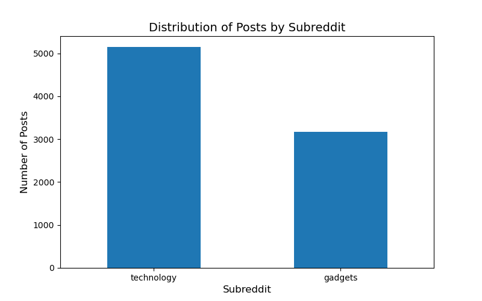
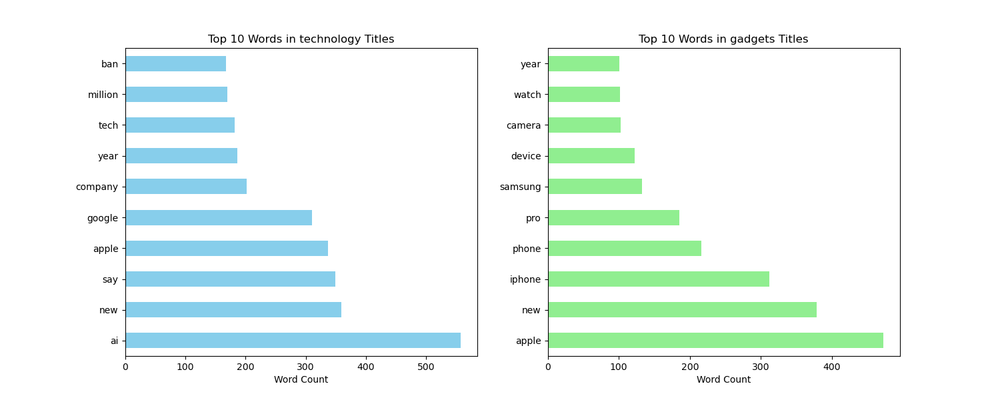

# Classifying Reddit Discussions to Identify Trending Technologies and Gadgets
## Problem Statement:

A global technology company aims to create a product that captures significant consumer interest and excitement upon launch. To achieve this, their product research team seeks to understand which technologies and gadgets are generating the most discussion among consumers. By analyzing user opinions from two key Reddit communities **technology** and **gadgets** the company can identify trending topics and popular devices.

Although a substantial amount of data has been scraped from Reddit, there is a limitation in the availability of labeled posts from these subreddits.As a data scientist,my task is to develop a machine learning model capable of accurately classifying Reddit posts as belonging to either technology or gadgets. This classification will enable the team to analyze user discussions, focus on the most talked-about technologies and gadgets, and provide valuable insights to guide their product development process.
## Background:
Reddit is a social media platform and online community where users share, discuss, and vote on content across a wide range of topics within subreddit forums.\
[r/technology](https://www.reddit.com/r/technology/) is one of the largest subreddits dedicated to discussions about technology. With millions of members, it serves as a hub for tech enthusiasts, professionals, and casual users to share news, insights, and opinions on the latest technological advancements. The subreddit covers a broad range of topics, including emerging technologies such as AI, quantum computing, cybersecurity, 5G, and blockchain. It is widely recognized as a platform where users discuss technology trends, breakthroughs, and innovations that shape industries and everyday life.\
[r/gadgets](https://www.reddit.com/r/gadgets/) is a subreddit focused on the latest consumer electronics, devices, and gadgets. With a highly engaged community, gadgets centers on product reviews, recommendations, and discussions about the functionality, usability, and innovations in consumer technology. From smartphones and smartwatches to gaming consoles and wearables, this subreddit is a go-to place for tech-savvy consumers to explore and discuss the latest gadgets on the market.

## Data Collection

The data for this project was sourced directly from Reddit using the Reddit API. We scraped post submissions from the technology and gadgets subreddits with a custom script that accessed the API. This approach ensured the collection of current and relevant discussions from these communities, allowing us to analyze trends in technology and gadgets.

### Size
- **Samples**: 8,306
- **Features**: 6

### Target
- **Type**: Classification
- **Target Variable**: subreddit
- The goal is to predict the subreddit by analyzing the text. We will use Reddit posts scraped from the technology and gadgets subreddits. The data will include:
### Data Dictionary
The data used for this project is posts from technology and gadgets, obtained using the Reddit API.
* [reddit_posts_comments.csv](./data/reddit_posts_comments1.csv): Contains all of the data for our model.

| Feature          | Type     | Dataset             | Description                                                                                   |
|------------------|----------|---------------------|-----------------------------------------------------------------------------------------------|
|post_id              | object    | reddit_posts| A unique identifier for each Reddit post.                                                                           |
| title            | object    | reddit_posts|The title of the Reddit post.
| content     | object    | reddit_posts| The body text or main content of the Reddit post.|
| created_utc       | float  |reddit_posts|The timestamp of when the post was created in UTC.
| subreddit    | object  | reddit_posts|The specific subreddit (e.g., technology or gadgets) where the post was made.|
|comments       | object    | reddit_posts| The list of user comments associated with the Reddit post.      

### Exploratory Data Analysis (EDA)
Below are some visual insights gathered during the Exploratory Data Analysis phase:

  
*Figure 1: Distribution of Posts by Subreddit.*

  
*Figure 2: Top ten words in Titles of Subreddits.*

These plots shows top ten words in the titles of technology and gadgets subreddits, as well as the overall distribution of the posts in the subreddits.

# Model Performance and Evaluation
We tested several classification models to analyze and classify text data from subreddits such as technology and gadgets. Using data from these subreddits, we classified posts into the categories "Technology" and "Gadgets". The goal was to compare the performance of each model using key metrics, including accuracy, specificity, recall, and F1-scores.
The models evaluated are:
1. Logistic Regression with Count Vectorizer
2. K-Nearest Neighbors (KNN) with TF-IDF Vectorizer
3. Naive Bayes with TF-IDF Vectorizer

### Summary of Model Performance

| **Model** | **Training Accuracy** | **Test Accuracy** | **Training Misclassification Rate** | **Test Misclassification Rate** | **Specificity** | **Recall** | **F1-score Technology** | **F1-score Gadgets** |
|-----------|-----------------------|-------------------|-------------------------------------|----------------------------------|-----------------|------------|-------------------------|----------------------|
| **Logistic Regression with Count Vectorizer** | 1.00 | 0.84 | 0.00 | 0.16 | 0.75 | 0.89 | 0.87 | 0.78 |
| **KNN with TF-IDF Vectorizer** | 0.88 | 0.84 | 0.12 | 0.16 | 0.83 | 0.85 | 0.87 | 0.80 |
| **Naive Bayes with TF-IDF Vectorizer** | 0.90 | 0.85 | 0.10 | 0.15 | 0.77 | 0.91 | 0.88 | 0.80 |

The **Naive Bayes with TF-IDF Vectorizer** model proved to be the optimal model for classifying text data in the technology and gadgets subreddits. It offers an excellent balance of precision, recall, and generalizability without overfitting. While other models like Logistic Regression with Count Vectorizer also performed well, Naive Bayes with TF-IDF is more versatile and effective for this task.

## Conclusion
The machine learning models developed in this project successfully classify Reddit posts from the technology and gadgets subreddits into two key categories: "technology" and "gadgets." This classification enables the global technology company to gain actionable insights into how online communities discuss technology innovations and gadgets. By leveraging these insights, the company can guide product development and marketing strategies to stay ahead in the competitive consumer electronics market.

After evaluating several models, Naive Bayes with Count Vectorizer emerged as the most balanced and effective model. It demonstrated strong performance across critical metrics, offering the best combination of accuracy and scalability.

## Key Takeaways
- **Accurate Classification of Posts**
The model achieved a high level of accuracy in distinguishing between posts from the technology and gadgets categories. This enables the automated analysis of large volumes of text data, facilitating a more efficient understanding of community discussions in different tech sectors.
- **Identification of Emerging Trends**
In the gadgets category, the top discussions revolved around  laptops, and headphones, highlighting key areas of consumer interest in electronics.
 - **Scalability and Real-World Application**
The machine learning model is scalable and can be applied to other subreddits or online platforms to continuously track and analyze technology trends. Additionally, the classification framework is adaptable to a variety of domains, making it useful beyond just technology-related discussions.
## Next Steps
- **Exploring more advanced models:** Consider implementing models like Random Forests, Support Vector Machines (SVM), or deep learning techniques to further enhance accuracy and prediction capabilities.
- **Continuously updating the model:** Regularly update the model with new data to ensure it reflects the latest trends in technology and consumer gadgets, maintaining relevance as discussions evolve.
